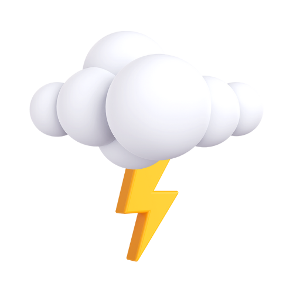
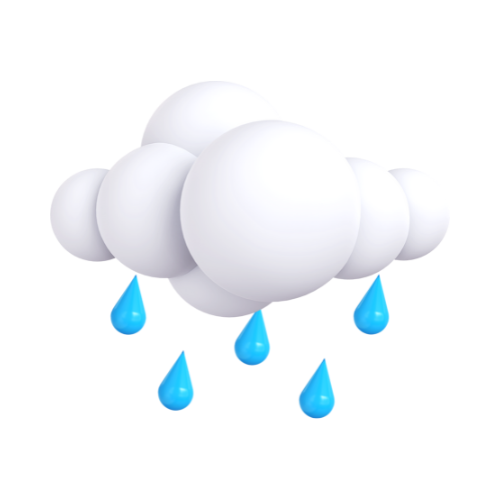
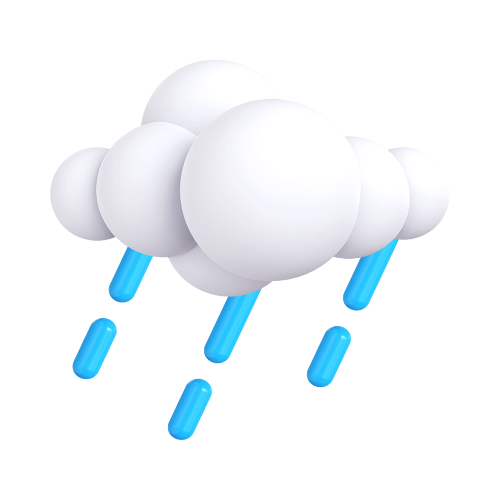

# AirHygro 🌦️

 <!-- Replace with a custom banner or animated GIF -->

[](https://flutter.dev)
[](https://flutter.dev)
[](LICENSE)

---

##  Overview

AirHygro is a cross-platform weather app built with Flutter. It fetches your current location and displays up-to-date weather information in a visually appealing interface.

---

##  Features

- **Real-Time Weather:** Automatically fetches and displays the current weather for your location.
- **Weather Details:** Shows temperature, weather condition (e.g., Thunderstorm), sunrise and sunset times, and daily highs/lows.
- **Beautiful UI:** Modern, visually rich interface with custom graphics and icons.
- **Cross-Platform:** Runs on Android, iOS, macOS, Linux, Windows, and Web.
- **Location Awareness:** Uses device location to provide local weather data.

---

##  Screenshots & Animations

| Home Screen           | Weather Details           | Animated Demo            |
| --------------------- | ------------------------- | ------------------------ |
|  |  |  |

<details>
  <summary>🌤️ <b>See More Screens</b></summary>




</details>

---

##  Quick Start

<details>
  <summary>👤 <b>For Non-Technical Users</b></summary>

1. **Install the app** (from your app store or provided installer).
2. **Open AirHygro.**
3. **Allow location access** when prompted.
4. View your local weather instantly!
</details>

<details>
  <summary>💻 <b>For Developers</b></summary>

```sh
git clone <your-repo-url>
cd airhygro
flutter pub get
flutter run
```

> The weather API key is currently hardcoded in `lib/data/my_data.dart`. For production, consider securing this key.

</details>

---

##  Project Structure

<details>
  <summary>Click to expand</summary>

```
lib/
  bloc/         # BLoC state management for weather
  data/         # API key and data config
  screens/      # UI screens (mainly HomeScreen)
  main.dart     # App entry point
assets/         # Weather icons and images
test/           # Widget and unit tests
```

</details>

---

##  Technical Details

- **State Management:** [flutter_bloc](https://pub.dev/packages/flutter_bloc)
- **Weather Data:** [weather](https://pub.dev/packages/weather) (OpenWeatherMap API)
- **Location:** [geolocator](https://pub.dev/packages/geolocator)
- **UI:** Material Design, custom assets

### Permissions

- **Android:**
  - `ACCESS_FINE_LOCATION`
  - `ACCESS_BACKGROUND_LOCATION`
- **iOS:**
  - `NSLocationWhenInUseUsageDescription`
  - `NSLocationAlwaysUsageDescription`

---

##  Testing

```sh
flutter test
```

Example widget test is provided in `test/widget_test.dart`.

---

##  Contributing

<details>
  <summary>Expand for steps</summary>

1. Fork the repo
2. Create your feature branch (`git checkout -b feature/YourFeature`)
3. Commit your changes (`git commit -am 'Add new feature'`)
4. Push to the branch (`git push origin feature/YourFeature`)
5. Open a Pull Request
</details>

---

##  License

[MIT](LICENSE) (or specify your license here)

---

**_Feel free to add more screenshots, GIFs, or update this README as the project evolves!_**
